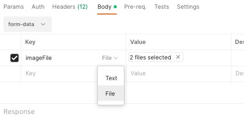

# Read Me First

# Getting Started

This document provides instructions for using the Imgur Spring Boot integration.

Requirements fulfilled:-
* User details such as username and password will be saved in the backend
* On Successfull authentication, user can view, upload and delete images from Imgur via APIs.
* Single or multiple images can be uploaded at a time.
* Images will not be accepted at the time of creation of new user.

# Technologies Used

The following technologies are used in this integration:

* Java 1.8
* Spring Boot 3.0.5

# User manual

This section describes how to use the Imgur Spring Boot integration.

* Post API - To create a new user, use the following API URL with the user details (username and password) as path parameters:

      {api-url}/api/users

The request body should be in JSON format and should include the following information:

        {
          "username":"{username}",
          "password":"{password}"
        }

* Get API - To retrieve user details, use the following API URL with the username and password as path parameters:

        {api-url}/api/users/{username}/{password}

If the username and password match, the API will return the user details along with all images uploaded for that user. If the username and password do not match, an error message will be returned.

* Put API - To upload images, use the following API URL with the username and password as path parameters:

      {api-url}/api/users/{username}/{password}/image

  Body for Put API - **imageFile** should be passed as Multipart Form.

  
The request body should be in Multipart Form and should include the image file.

If the username and password match, the API will return success message. If the username and password do not match, an error message will be returned.

* Delete API - To delete images or a user, use the following API URL with the username and password as path parameters:

  
  To delete images or a user, use the following API URL with the username and password as path parameters:

        {api-url}/api/users/{username}/{password}

  If the image ID is passed as a parameter, the API will delete the single image from the user's record and from Imgur. If the image ID is not passed, the entire user record along with all associated images will be deleted from the table and from Imgur.

        {api-url}/api/users/{imageid}/{username}/{password}

If the username and password match, the API will return success message. If the username and password do not match, an error message will be returned.

# Limitations

* Basic Authentication for APIs
* Test classes are not included

